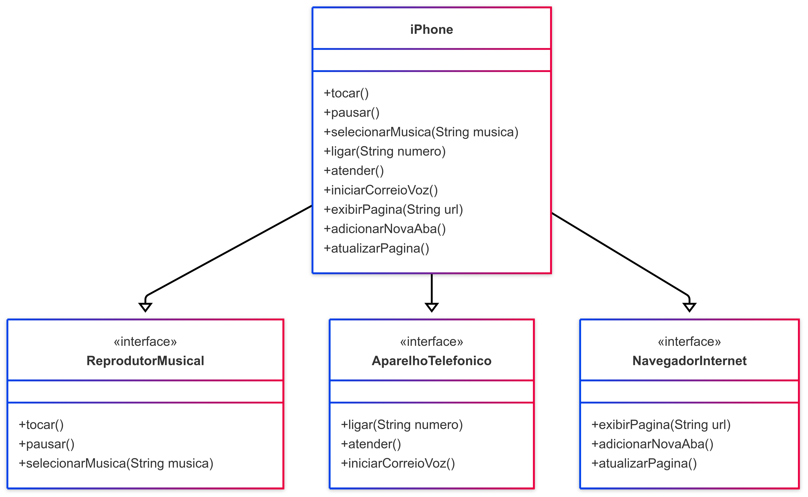
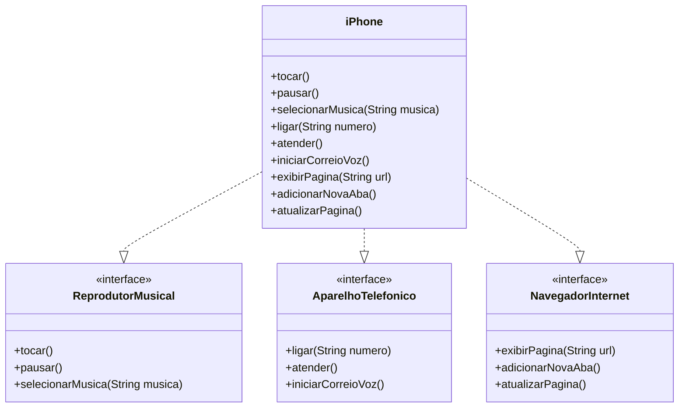

# 📱 Desafio de Modelagem POO - Componente iPhone

Este projeto representa a modelagem UML e a implementação em Java do **componente iPhone**, com base no vídeo de lançamento do iPhone de 2007. O iPhone neste modelo possui funcionalidades de:

- 🎵 Reprodutor Musical
- 📞 Aparelho Telefônico
- 🌐 Navegador na Internet

---

## 🎯 Funcionalidades Modeladas

### Reprodutor Musical

- `tocar()`
- `pausar()`
- `selecionarMusica(String musica)`

### Aparelho Telefônico

- `ligar(String numero)`
- `atender()`
- `iniciarCorreioVoz()`

### Navegador na Internet

- `exibirPagina(String url)`
- `adicionarNovaAba()`
- `atualizarPagina()`

---

## 🧩 Diagrama UML

### 🔗 Código em Mermaid

